  

  

  
  
  

---

### ⚡ In one line
Computer Engineering student at **VIT Pune** turning AI into things that ship, publish, and pay.

### 🏆 Proof, not adjectives
- 📄 **DermaScanAI**, published at **ICRACS 2026** (Springer, Scopus-indexed)
- 🛠️ Hackathon builder: **Smart India Hackathon 2026**, **deepEntra BuildFest 2026**, **iQOO Battle 02**
- 🚀 Founder of an **AI automation agency** building chatbots and lead-response systems for businesses

### 🔭 Currently building
- **Speed-to-lead automation**: instant lead response for US businesses, running on a zero-cost stack
- **Project Ascension**: an immersive six-world portfolio in React + Vite

### 🧩 Selected work

| Project | What it is | Built with |
|:--|:--|:--|
| [**PatchPilot**](https://github.com/OMEExZORO/iQOO_real_project) | Self-healing dependency remediation: patches vulnerable packages, runs the repo's own tests, and feeds failures back to an LLM until the fix holds | Python · FastAPI · TypeScript |
| [**CrowdPath**](https://github.com/OMEExZORO/EDI_SY_II_CrowdPath) | Indoor navigation for visually impaired users using crowdsourced ARCore maps, WiFi fingerprinting, and a BLE smart cane | Kotlin · FastAPI |
| [**GroupSync**](https://github.com/OMEExZORO/GroupSync_MLSC-Hackspiration) | Contribution tracking and grade distribution for group projects, recorded on Algorand. Hackspiration 2026 | TypeScript · Algorand |
| [**Pune Vahan Seva**](https://github.com/OMEExZORO/PuneVahanSeva) | Bilingual (English/Marathi) PMPML bus and Pune Metro route search with live ETAs and an admin console | React · Flask |
| [**GeoX**](https://github.com/OMEExZORO/geoX-DS) | Mini Google Maps backend engine benchmarking 8 advanced data structures | C++ |

### 🛠️ Stack

  

### 📊 Signal

  
  

  <picture>
    <source media="(prefers-color-scheme: dark)" srcset="https://raw.githubusercontent.com/OMEExZORO/OMEExZORO/output/github-snake-dark.svg"/>
    <source media="(prefers-color-scheme: light)" srcset="https://raw.githubusercontent.com/OMEExZORO/OMEExZORO/output/github-snake.svg"/>
    
  </picture>

---

  <b>Open to:</b> AI/ML internships · research collaborations · automation projects 
  <i>Invictus Kairos. Unconquered, at the right moment.</i> · Om Soma

